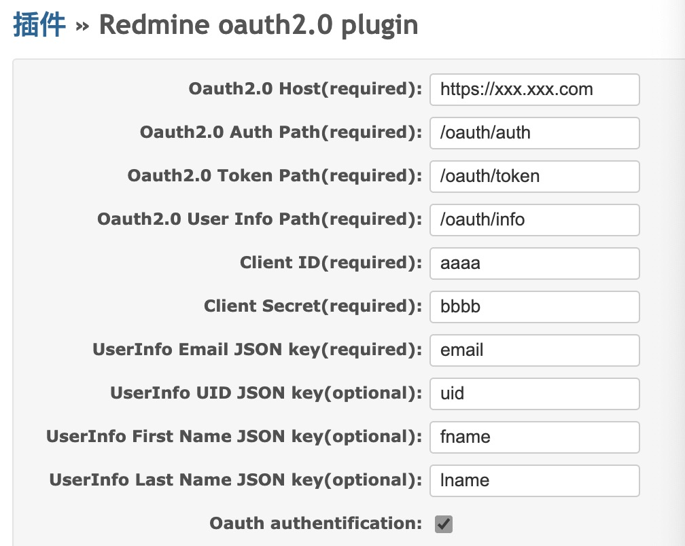

## This is a general oauth 2.0 login redmine plug-in




## install 
```console
apt-get install -y make gcc git
cd x/redmine/plugins
git clone https://github.com/nomadli/redmine_oauth2
cd x/redmine
bundle install --without development test
rake redmine:plugins:migrate RAILS_ENV=production
touch x/redmine/tmp/restart.txt
```
